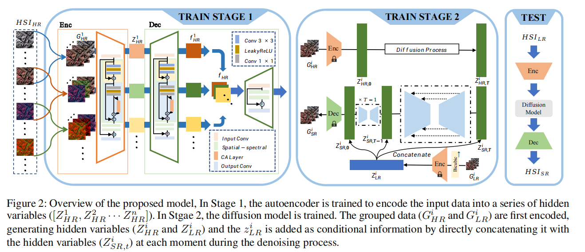
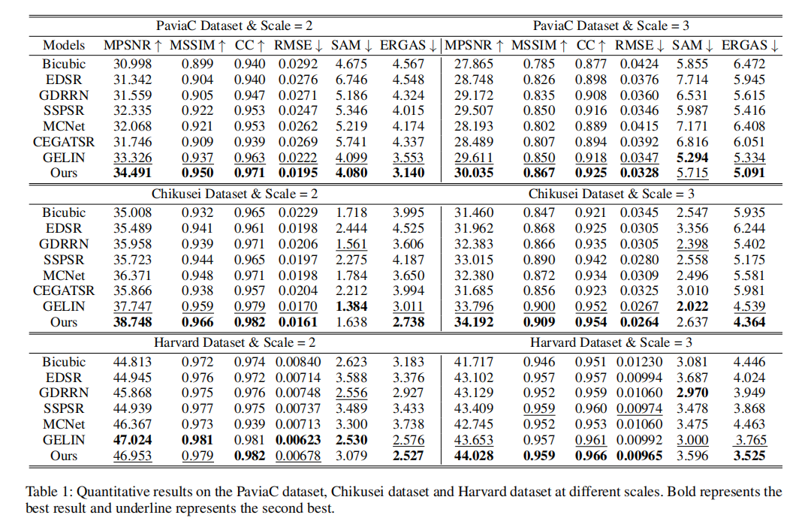
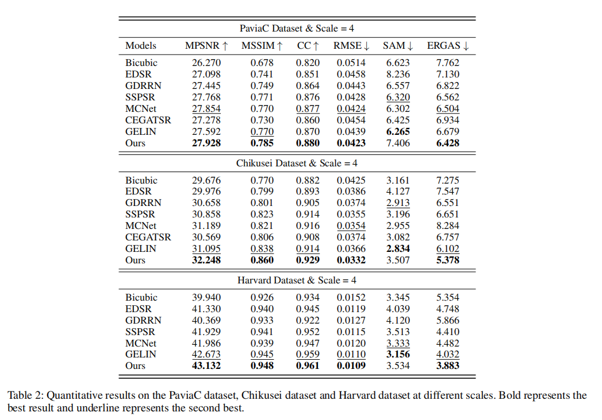
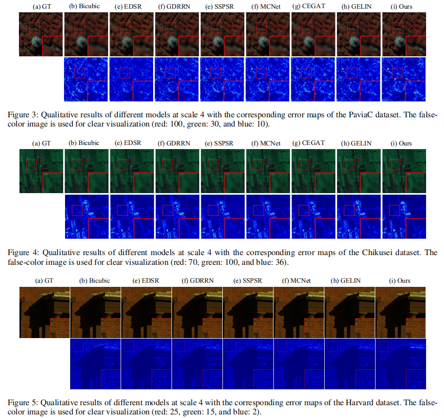

# HSI-DMGASR (AAAI2024) Documentation
(Zhaoyang Wang, Dongyang Li, Mingyang Zhang†, Hao Luo, Maoguo Gong)
This repository contains the source code for the paper "Enhancing Hyperspectral Images via Diffusion Model and Group-Autoencoder Super-Resolution Network". The code is based on SR3, SSPSR, and GELIN. The implementation is divided into two main stages:
1. Training the Group-Autoencoder (GAE)
2. Joint Training with the Diffusion Model

## Network Architecture


---

> *Existing hyperspectral image (HSI) super-resolution (SR)
methods struggle to effectively capture the complex spectral-spatial relationships and low-level details, while diffusion
models represent a promising generative model known for
their exceptional performance in modeling complex relations and learning high and low-level visual features. The
direct application of diffusion models to HSI SR is hampered by challenges such as diffculties in model convergence and protracted inference time. In this work, we introduce a novel Group-Autoencoder (GAE) framework that
synergistically combines with the diffusion model to construct a highly effective HSI SR model (DMGASR). Our proposed GAE framework encodes high-dimensional HSI data
into low-dimensional latent space where the diffusion model
works, thereby alleviating the diffculty of training the diffusion model while maintaining band correlation and considerably reducing inference time. Experimental results on both
natural and remote sensing hyperspectral datasets demonstrate that the proposed method is superior to other state-of-the-art methods both visually and metrically.* 
---

## Experiment Results





## Installation
To install the required dependencies for the project, run:

```
pip install -r requirements.txt
```

## Usage Instructions
### Training the GAE
After configuring the dataset paths, execute the following command to train the GAE:

```
python AE.py
```

### Training the Diffusion Model
Once the GAE is trained and the dataset paths are configured, load the pre-trained GAE model and train the diffusion model by running:

```
python sr_gae.py
```
In sr_gae.py, you can switch between training and inference modes.

## Configuration Details
The configuration file for training is located at EHSI-DMGESR/config/sr_sr3_16_128.json. Dataset paths and other parameters are set within this file. There are two data processing methods used in the experiments:
1. Using TrainsetFromFolder: This method follows the data processing approach from MCNet. After processing the dataset locally with MATLAB, the data is read directly.
2. Using HSTrainingData and HSTestData: These functions handle data processing online, providing greater flexibility. Refer to the definitions of these functions for detailed usage.

## Notes
This project is primarily based on the SR3, SSPSR, and MCNet frameworks.
